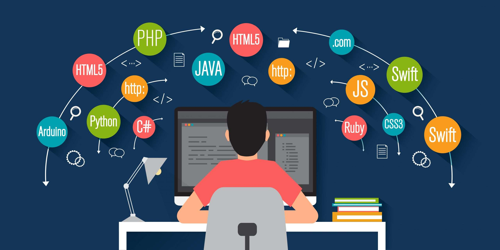

# Presentación de Guillermo Jiménez

## Descripción de la página:
En esta pagina te vas a encontrar ciertas características sobre mi y mi pasión, la programación, soy técnico en desarrollo de aplicaciones multiplataforma, especializado en desarrollo con Kotlin utilizando Android SDK y Jetpack Compose.

## Características sobre mi:
- Formación:
  - Formacion profesional Superior Desarrollo Aplicaciones Multiplataforma
  - Formacion profesional Superior Animación 3D, videojuegos y entornos interactivos.
  - Formación profesional Superior Administración y Finanzas.
          
- Sobre mi: Apasionado del desarrollo de aplicaciones y desarrollo de videojuegos, actualmente realizando proyectos propios con los cuales crecer a nivel personal y entender mejor todas las tecnologías que abarcan el gran mundo del desarrollo de aplicaciones.

## 💻 Lenguajes de programación mas utilizados:
- Kotlin
- Dart
- Java
- Python
- SQL
- C#

## 📱 Desarrollo móvil Android
- Jetpack Compose
- Android SDK
- Firebase (Auth, Firestore, Storage)
- MVVM (arquitectura)
- Coroutines y Flow
- ViewModel / LiveData
- Navigation Component

## 🎮 Entornos y motores gráficos:
- Unity
- Autodesk Maya
- Blender

## 🕹️ Desarrollo videojuegos:
- Manejo de inputs con teclado, raton o mando.
- Terrains para generar terrenos en Unity.
- NavMesh para creación de enemigos con IA.
- Rigidbody y colliders.
- Animator.
- Particulas.

## 🔧 Lenguajes de soporte
- Kotlin
- XML
- Gradle

## ☁️ Cloud / Backend
- Firebase Functions

## Otros entornos de desarrollo:
- Visual Studio Code
- JUnit

## Gestor de proyectos:
- Jira

## Controladore de versiones:
- Git
- Git Hub

## Últimas experiencias laborales:
- Técnico de operaciones en AbaiGroup
- Desarrolador UI en Threan
